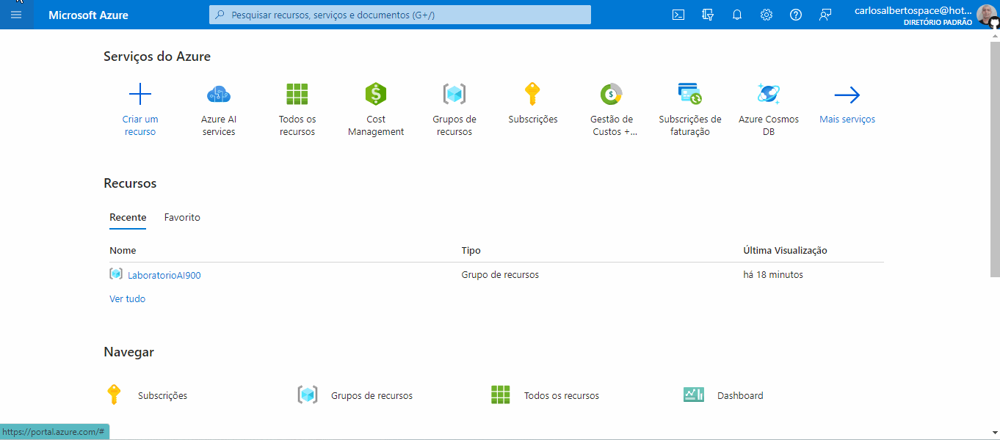
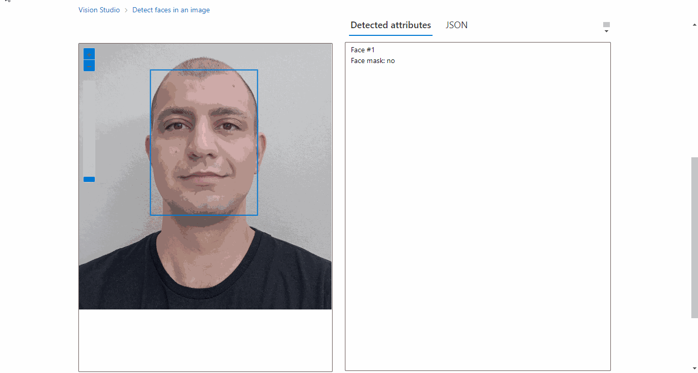

# Reconhecimento Facial e transformação de imagens em Dados no Azure ML

Passo a passo do desafio de projeto "Reconhecimento Facial e transformação de imagens em Dados no Azure ML" da DIO.

Links importantes:

[Detect faces in Vision Studio](https://microsoftlearning.github.io/mslearn-ai-fundamentals/Instructions/Labs/04-face.html)

[Read text in Vision Studio](https://microsoftlearning.github.io/mslearn-ai-fundamentals/Instructions/Labs/05-ocr.html)

[Analyze images in Vision Studio](https://microsoftlearning.github.io/mslearn-ai-fundamentals/Instructions/Labs/03-image-analysis.html)

## Passo 1: Criando recurso do Face API no Azure AI Services para detecção de faces humanas

Primeiro precisei criar um recurso de Face API dentro Azure Ai Services.

Após o recurso ter sido criado, acessei o [Portal de Visão do Azure](https://portal.vision.cognitive.azure.com/gallery/featured). Na página inicial, acessei a aba "Face" e cliquei em "Detect faces in an images".

Na próxima página, em "Try it out", precisei informar o recurso criado anteriormente no Portal do Azure para testar. Sem escolher o recurso, não consegui obter a resposta do teste.

Então subi uma foto minha e consegui obter o resultado do teste.

Em seguida, tentei fazer um [teste](https://learn.microsoft.com/en-us/azure/ai-services/computer-vision/quickstarts-sdk/identity-client-library?tabs=windows%2Cvisual-studio&pivots=programming-language-python) usando Python para acessar o serviço, porém não consegui terminar pois é necessário ser cliente ou um dos parceiros gerenciados pela Microsoft. Para ser aprovado, é necessário enviar o seguinte formulário e esperar a aprovação: [http://aka.ms/facerecognition](http://aka.ms/facerecognition).

[Clique aqui](Detecção_de_Faces_com_Face_API.ipynb) para ver o notebook que comecei para testar o Face API com Python.

Saiba mais sobre a limitação de API: [Recursos de Acesso Limitado para os serviços de IA do Azure](https://learn.microsoft.com/pt-br/azure/ai-services/cognitive-services-limited-access)
